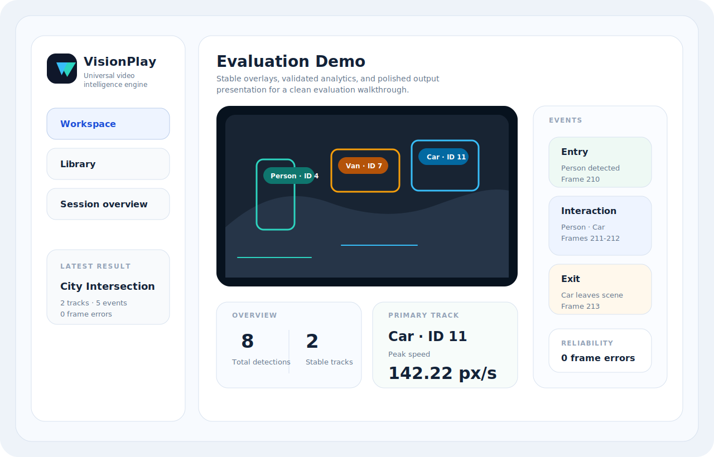

# VisionPlay

VisionPlay is a production-oriented universal video intelligence system. It accepts uploaded videos, runs YOLO-based detection, stabilizes tracking with ByteTrack plus fallback matching, filters noisy detections, recomputes analytics from normalized tracks, and renders the results in a clean React workspace.

Repository: [github.com/Suraj1812/VisionPlay](https://github.com/Suraj1812/VisionPlay)

The system is intentionally generic. It does not assume a specific sport, camera angle, or object taxonomy. It works with any class labels supported by the configured detection model and produces reusable analytics for general video understanding workflows.

For evaluation scenarios, the strongest results come from steady or moderately moving cameras, clear object separation, reasonable lighting, and limited full-frame occlusion. The pipeline still handles noisier footage safely, but the polished demo story is best shown on clean real-world scenes such as traffic, pedestrian, retail, or warehouse video.

## Live Deployment

VisionPlay is live on Railway.

- app: [frontend-production-4950.up.railway.app](https://frontend-production-4950.up.railway.app)
- backend: [backend-production-cb8c.up.railway.app](https://backend-production-cb8c.up.railway.app)
- health check: [backend-production-cb8c.up.railway.app/health](https://backend-production-cb8c.up.railway.app/health)

Current hosted setup:

- Railway frontend service serving the Vite build through Nginx
- Railway backend service running FastAPI and the video intelligence pipeline
- persistent Railway volume attached to the backend for media storage and the current SQLite runtime database

As of April 19, 2026, the public deployment has been verified with:

- frontend `200` response
- backend `/health` returning `status=ok`
- backend CORS allowing the live frontend origin

## What It Does

- accepts large video uploads
- processes videos asynchronously with progress reporting
- runs object detection on full frames and tiled crops for small-object recovery
- re-scans uncertain regions with a custom high-detail refinement pass for better recall
- tracks objects across frames with stable IDs and smoothing
- suppresses overlays, edge-region noise, implausible boxes, and unstable short tracks
- computes reusable analytics such as trajectories, duration, speed, entry and exit events, and interactions
- writes an annotated output MP4
- shows the results in a minimal web dashboard with upload progress, live processing percentage, overlay playback, and analytics panels

## How It Works

### Backend

- `backend/api`
  - FastAPI routes for upload, status, and results
- `backend/services`
  - upload persistence, background processing orchestration, and result normalization
- `backend/models`
  - response schemas for detections, tracks, events, and video metadata
- `backend/database`
  - SQLAlchemy entities for videos, detections, and tracks
- `backend/utils`
  - shared configuration and logging

### Intelligence Pipeline

- `ai/detection/yolo_detector.py`
  - model loading, tracked-class filtering, tiled inference for configured small classes, and class-aware NMS merging
- `ai/tracking/byte_tracker.py`
  - ByteTrack integration, fallback ID continuity, size-aware matching, stale-track cleanup, and box smoothing
- `ai/pipeline/video_processor.py`
  - frame loop, scene-cut resets, detection filtering, overlay-ignore regions, annotation rendering, and progress callbacks
- `ai/pipeline/analytics.py`
  - trajectory construction, motion metrics, duration metrics, primary-track ranking, and generic event inference

### Frontend

- `frontend/src/context/VisionPlayContext.jsx`
  - upload state, session persistence, polling, and results caching
- `frontend/src/components`
  - upload modal, progress UI, overlay player, session cards, and analytics dashboard
- `frontend/src/pages`
  - workspace, library, and result routes
- `docker`
  - production container images, compose stack, and static frontend server configuration
- `.github/workflows`
  - CI automation for tests, builds, launcher verification, and Docker config validation

## Key Features

### Universal labels instead of hardcoded classes

Detections and tracks now retain generic `object_type` values from the detector. The pipeline no longer assumes special handling for specific labels like player or ball.

### Accuracy from sanitized geometry, not raw model summaries

All final metrics are rebuilt from normalized detections and track paths. The backend does not trust upstream summary values for speed, duration, primary objects, or events.

### Tracking stability over raw recall

The pipeline favors clean, stable tracks:

- short-lived tracks are dropped
- implausible jumps split segments
- stale IDs are pruned
- box smoothing reduces flicker
- ByteTrack failures fall back to local continuity logic instead of crashing the run
### Noise suppression for real-world videos

The processor filters:

- tiny boxes
- oversized frame-dominating boxes
- low-signal detections
- boxes dominated by top, bottom, or side overlay regions
- visually flat low-confidence boxes that often correspond to broadcast graphics or static UI

## Why It Is Reliable

- analytics are recomputed from cleaned tracks instead of trusting raw model summaries
- detections are filtered by confidence, size, aspect ratio, ignored UI regions, and visual support
- unstable short tracks are removed before they reach analytics or overlay playback
- timestamps, durations, speeds, and events are normalized so malformed edge-case payloads do not break output consistency
- scene cuts reset stale tracking state, and tracker fallbacks keep the pipeline running when a frame is difficult
- processing is streamed frame by frame, so large videos do not require loading the whole asset into memory
- the health endpoint returns HTTP `503` when storage or database dependencies are degraded, which makes container health checks meaningful in production

## Analytics Output

Each completed analysis returns:

- frame-level detections
- stable tracks with paths, speeds, durations, and confidence
- per-class detection and track breakdowns
- primary track ranking
- generic entry and exit events
- interaction windows when tracked objects remain close across consecutive frames

An example response is included at [`examples/universal-results.example.json`](examples/universal-results.example.json).

## Demo Package

- sample normalized API output: [`examples/universal-results.example.json`](examples/universal-results.example.json)
- sample UI presentation board: [`examples/demo-ui.svg`](examples/demo-ui.svg)



The included demo artifacts are tuned to show the product in a best-case evaluation setting: a clean urban traffic clip with stable motion, readable object separation, and consistent track continuity.

## Frontend Experience

- upload dialog with live percentage popup
- processing status with live completion percentage
- routed results pages
- source or processed video playback
- real-time overlay boxes with IDs
- analytics dashboard with overview, object breakdowns, primary tracks, motion ranking, and event summaries

## Configuration

The pipeline is configurable through `backend/utils/config.py`.

Key settings include:

- YOLO model path and image size
- automatic local model preference, so stronger weights are used when present while offline clones still fall back to the bundled local YOLO weight
- YOLO device selection for CPU, CUDA, or Apple Metal
- tracked class allowlist
- small-object class list and tile settings
- detection confidence and NMS thresholds
- tracker activation, smoothing, and stale-frame thresholds
- scene-cut threshold
- overlay ignore-region ratios
- minimum stable track requirements
- interaction distance and duration thresholds

## Local Development

### Quick Start

```bash
git clone https://github.com/Suraj1812/VisionPlay.git
cd VisionPlay
./run doctor
./run verify
./run
```

The launcher creates `.env` from `.env.example`, installs backend and frontend dependencies, and starts the local stack on the default ports.

### Production Stack

```bash
cd VisionPlay
cp .env.example .env
./run prod
```

The production stack uses:

- PostgreSQL 16
- a non-root backend container with the bundled offline-safe `yolov8n.pt` model
- an unprivileged Nginx frontend container with SPA routing and static asset caching
- Docker health checks that fail fast when dependencies degrade
- named volumes for database persistence and uploaded media

### Manual Start

Backend:

```bash
cd VisionPlay/backend
python3 -m venv .venv
. .venv/bin/activate
pip install -r requirements.txt
cd ..
backend/.venv/bin/uvicorn backend.main:app --reload --host 0.0.0.0 --port 8000
```

Frontend:

```bash
cd VisionPlay/frontend
npm install
npm run dev
```

## Verification

Backend tests:

```bash
cd VisionPlay
backend/.venv/bin/python -m unittest discover -s backend/tests -v
```

Compile check:

```bash
cd VisionPlay
PYTHONPYCACHEPREFIX=/tmp/visionplay-pyc backend/.venv/bin/python - <<'PY'
from pathlib import Path
import py_compile

for root_name in ("backend", "ai"):
    for path in Path(root_name).rglob("*.py"):
        if ".venv" in path.parts or "__pycache__" in path.parts:
            continue
        py_compile.compile(str(path), doraise=True)
PY
```

Frontend build:

```bash
cd VisionPlay/frontend
npm run build
```

Launcher verification:

```bash
cd VisionPlay
./run verify
```

## DevOps

- GitHub Actions CI is defined in [`.github/workflows/ci.yml`](./.github/workflows/ci.yml)
- CI runs backend unit tests, Python compilation checks, frontend production build, launcher verification, and Docker Compose validation
- Docker production assets live in [`docker/Dockerfile.backend`](./docker/Dockerfile.backend), [`docker/Dockerfile.frontend`](./docker/Dockerfile.frontend), and [`docker/docker-compose.yml`](./docker/docker-compose.yml)

### Railway

The current live environment uses two Railway services:

- `frontend`
  - builds with [`docker/Dockerfile.frontend`](./docker/Dockerfile.frontend)
  - serves the production frontend on [frontend-production-4950.up.railway.app](https://frontend-production-4950.up.railway.app)
- `backend`
  - builds with [`docker/Dockerfile.backend`](./docker/Dockerfile.backend)
  - serves the API on [backend-production-cb8c.up.railway.app](https://backend-production-cb8c.up.railway.app)
  - mounts a persistent Railway volume at `/app/runtime`

Deployment notes for Railway:

- [`/.railwayignore`](./.railwayignore) keeps local-only files like `backend/.venv`, uploaded media, and frontend build artifacts out of CLI uploads
- [`railway.backend.json`](./railway.backend.json) defines the backend rollout contract used by GitHub deploys, including `/ready` healthchecks and backend-specific drain timing
- [`railway.frontend.json`](./railway.frontend.json) defines the frontend rollout contract used by GitHub deploys, including `/` healthchecks and frontend overlap timing
- the backend Docker image installs CPU-only PyTorch wheels for Railway builds, which avoids unnecessarily pulling full CUDA stacks in production
- frontend build-time API routing is configured through `VITE_API_BASE_URL`
- backend CORS is configured to allow the live frontend domain plus local development ports
- the backend service now uses Railway deployment variables for safer rollouts:
  - `RAILWAY_HEALTHCHECK_TIMEOUT_SEC=180`
  - `RAILWAY_DEPLOYMENT_DRAINING_SECONDS=20`
- the frontend service now uses:
  - `RAILWAY_DEPLOYMENT_DRAINING_SECONDS=10`
  - `RAILWAY_DEPLOYMENT_OVERLAP_SECONDS=15`

### GitHub -> Railway Auto Deploy

The repository is prepared for automatic Railway deployments from GitHub Actions.

- CI continues to run from [`.github/workflows/ci.yml`](./.github/workflows/ci.yml)
- after `verify` passes on pushes to `main`, the `deploy_railway` job deploys `backend` and `frontend` to the live Railway project
- the deploy job copies `railway.backend.json` or `railway.frontend.json` into `railway.json` before each service deploy so Railway receives service-specific healthcheck and rollout settings
- the backend deployment is held to the `/ready` check before the workflow proceeds
- the frontend deployment is checked with an HTTP readiness probe after rollout

To enable the deploy job in GitHub, add one repository secret:

- `RAILWAY_TOKEN`
  - recommended value: a Railway **project token** scoped to the production environment of the `VisionPlay` project

Once that secret is present, pushes to `main` will automatically update Railway after CI passes.

## API

### `POST /upload-video`

Uploads a video, creates a video record, and queues background processing.

### `GET /status/{video_id}`

Returns job status, timestamps, error message, and live processing percentage.

### `GET /results/{video_id}`

Returns normalized video metadata, summary metrics, events, frame detections, and stable tracks.

## Production Notes

- The backend is modular and service-oriented, so detector, tracker, and analytics logic can evolve independently.
- The detector supports `YOLO_MODEL_PATH=auto`, which prefers stronger local weights such as `yolov8s.pt` when available but falls back to the bundled offline-safe `yolov8n.pt` model for reliable fresh-clone and container startup.
- SQLite works for local development. The production compose stack uses PostgreSQL-backed deployment by default.
- Processing is frame-streamed through OpenCV and writes the output incrementally, which keeps memory usage predictable for larger files.
- The frontend production image serves the built React app through Nginx with SPA route fallback and immutable caching for static assets.
